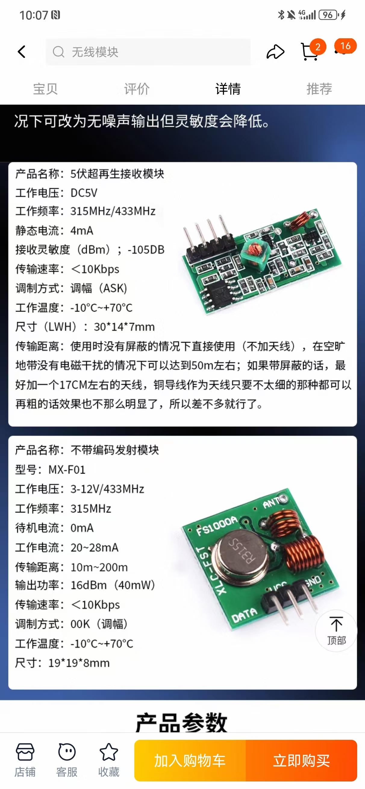

# pi5-433mhz-tools

Minimal 433 MHz communication helpers for the Raspberry Pi 5 using
[gpiozero](https://gpiozero.readthedocs.io/).

## Requirements

- Python 3
- [`gpiozero`](https://gpiozero.readthedocs.io/)

Install the GPIO Zero library with:

```bash
pip install gpiozero
```

## Components

- `rfdevice.py` – Helper classes for sending and receiving codes.
- `sender.py` – Send a single integer code.
- `receive.py` – Listen and print received codes.

## Wiring

Typical wiring for common 433&nbsp;MHz modules:

- **Transmitter**
  - `VCC` → 5&nbsp;V (GPIO header pin&nbsp;2 or&nbsp;4)
  - `GND` → any ground pin
  - `DATA` → GPIO&nbsp;17 by default (`--pin` to change)

- **Receiver**
  - `VCC` → 5&nbsp;V (pin&nbsp;2 or&nbsp;4)
  - `GND` → any ground pin
  - `DATA` → GPIO&nbsp;27 by default (`--pin` to change)
  - Some boards expose two `DATA` pins; either one works.

A short ~17&nbsp;cm wire connected to the antenna pad can improve range.

## Usage

Send a code on GPIO 17:

```bash
python3 sender.py --pin 17 --protocol 1 1234
```

Listen for codes on GPIO 27:

```bash
python3 receive.py --pin 27 --protocol 1
```

Example setup:



## License

This project is released under the MIT license.
